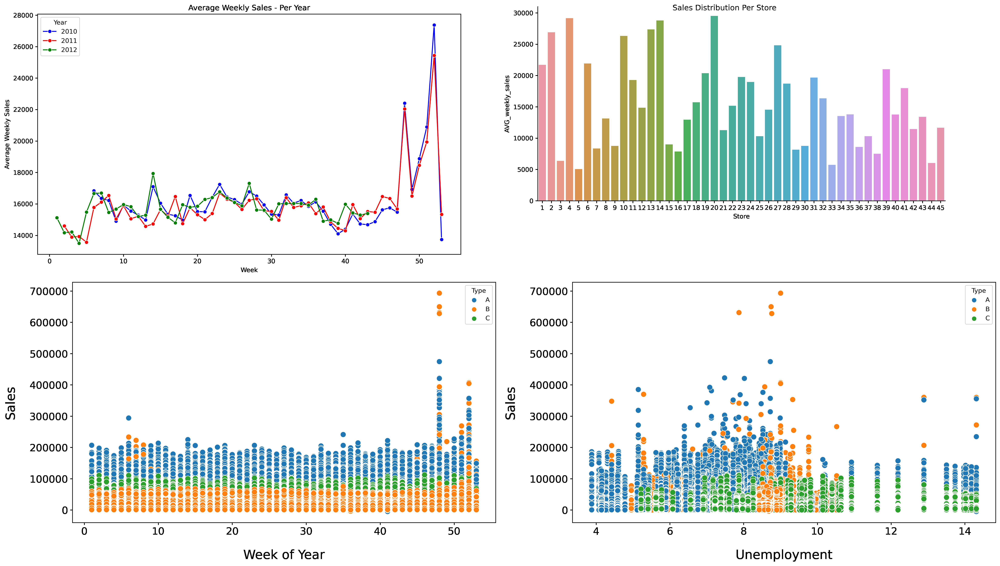
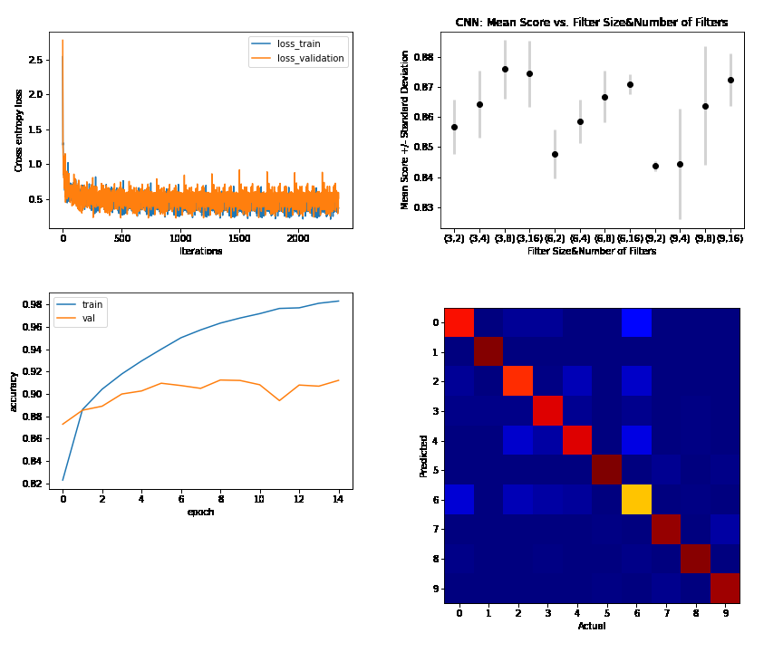
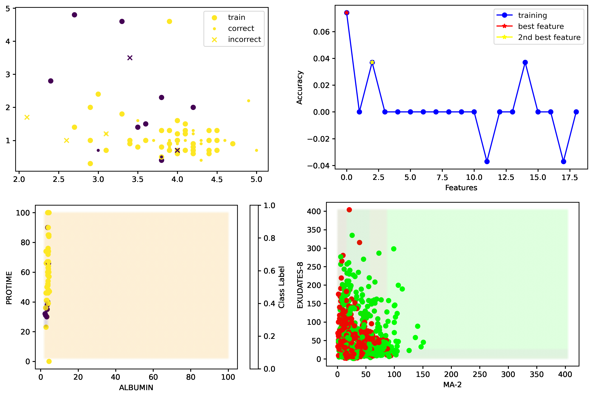
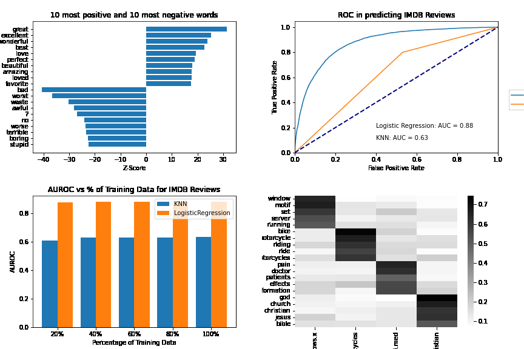

# Portfolio

---

### Predict Department-Wide Sales at Walmart with Advanced Regression Models

I loaded the data into SQL for initial processing and created data frames ready for visualizations in Python. After comprehensive exploratory data analysis to understand the data distribution, linear relationships, feature correlation, and seasonality effects, I utilized AutoML to compare models and determine feature importance. I built and fine-tuned machine learning models, including XGBoost, to predict Walmart's weekly sales. My best model achieved a Root Mean Squared Error (RMSE) of  <b>$2968.84</b>  and an R-squared value of  <b>0.9830</b>, capturing <b>98.3% </b> of the variance in the target variable. The strong performance in predicting sales underscores the model's potential as a valuable tool for inventory management and strategic decision-making in the retail industry.

 

 

---

### Performance Analysis of MLP and CNN on Fashion MNIST: A Study in Neural Network Optimization

<b>Please refer to the pdf for a comprehensive breakdown of the project</b>

The exploration of Multilayer Perceptron Models (MLP) and Convolutional Neural Networks (CNN) for image classification is central to the advancement of neural network efficiency. In this notebook, I'll leverage various architectures of MLP, including varying hidden layers, activation functions, and L2 regularization, to analyze their performance on the Fashion MNIST dataset. I will also introduce a CNN model for comparison. A series of experiments lead to the identification of an optimized MLP architecture that closely approaches the accuracy of the CNN model. The importance of preprocessing, correct activation functions, and avoiding overfitting were also highlighted, culminating in insights that can serve as a valuable foundation for further research and development in the field of neural networks.

 

 

---

#### Comparative Analysis of Logistic Regression and K-Nearest Neighbors on IMBD Movie Reviews and 20-News-Group Dataset: Binary and Multi-Class Classification

In this study, logistic regression and multi-class regression models were implemented from scratch to test against K-Nearest Neighbors (KNN) in binary and multi-class classification tasks. Experiments on IMBD movie reviews and the 20-news-group dataset demonstrated that logistic and multi-class regression significantly outperformed KNN. For binary classification, logistic regression achieved an AUROC of 0.8779 compared to KNN's 0.6343, and for multi-class classification, the accuracy was 74.80% versus KNN's 46.12%. The results suggest further exploration with regularization and advanced optimization techniques.

 

 

---

### Analyze Hepatitis and Diabetic Retinopathy Datasets: K-Nearest Neighbors and Decision Trees for Classification

In this hands-on project, we dug deep into the world of medical diagnostics, pitting K-Nearest Neighbors (KNN) against Decision Trees (DT) on Hepatitis and Diabetic Retinopathy Debrecen datasets. By experimenting with various hyperparameters and distance functions, we sharpened our tools to achieve impressive accuracies—88.89% for KNN and 85.2% for DT on the Hepatitis dataset. The results reveal not only the power of these machine learning techniques but also the nuanced decisions involved in optimizing performance. Whether it's the choice of distance function for KNN or the cost function for DT, this analysis demonstrates the craftsmanship required to excel in machine learning.

 

 

---

